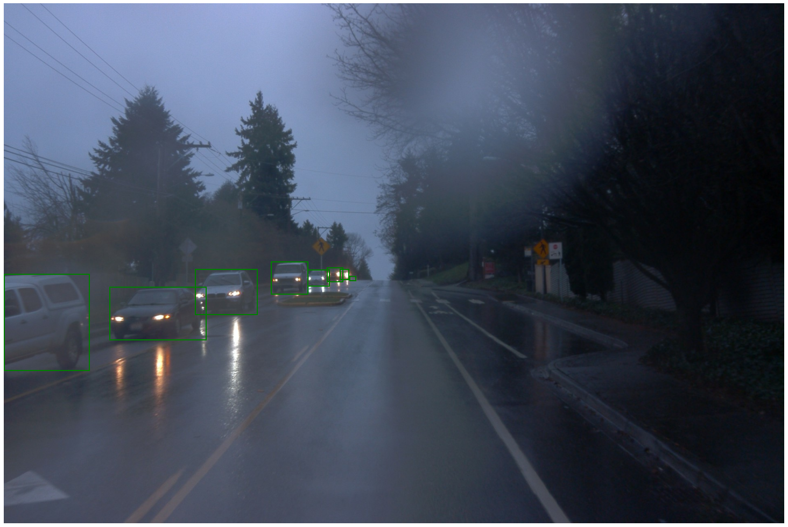
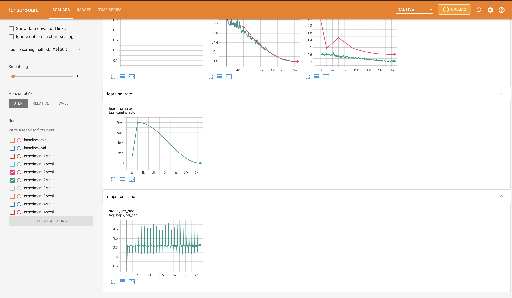
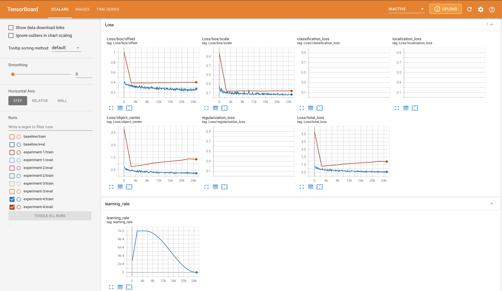

# Object detection in an Urban Environment

### Project overview

In this project, we are going to train a model that can detect vehicles, pedestrians and cyclists in an image.
* This is a very useful and the fist step of the self driving car so that it can be aware of the objects around it.
* This way, it can track these objects and plan accordingly to be able to drive the car around.

* [Tensorboard dev experiment results](https://tensorboard.dev/experiment/gdCqYz4tRbqIE0D3YI57zQ/)
* [Youtube playlist of three demo videos](https://www.youtube.com/playlist?list=PLHHVydoaGB3HpJJq6P_hkLlIU3xLQZ19-)

## Data

For this project, we have used the [Waymo Open dataset](https://waymo.com/open/). The files can be downloaded directly from the website as tar files or from the [Google Cloud Bucket](https://console.cloud.google.com/storage/browser/waymo_open_dataset_v_1_2_0_individual_files/) as individual tf records. 

## Structure

The experiments have been organized in the following manner-
```
experiments/
    - baseline/...
    - experiment1/...
    - experiment2/...
    - experiment3/...
    - experiment4/...
```
Each of these experiments director has a config file for that experiment.

### Local Setup

For local setup if you have your own Nvidia GPU, you can use the provided Dockerfile and requirements in the [build directory](./build).

Follow [the README therein](./build/README.md) to create a docker container and install all prerequisites.


## Instructions

### Download and process the data

The first goal of this project is to download the data from the Waymo's Google Cloud bucket to your local machine. For this project, we only need a subset of the data provided (for example, we do not need to use the Lidar data). Therefore, we are going to download and trim immediately each file. In `download_process.py`, you can view the `create_tf_example` function, which will perform this processing. This function takes the components of a Waymo Tf record and saves them in the Tf Object Detection api format using the images from the front camera of the car. An example of such function is described [here](https://tensorflow-object-detection-api-tutorial.readthedocs.io/en/latest/training.html#create-tensorflow-records). The `label_map.pbtxt` file is already provided.

We can run the script using the following (you will need to add your desired directory names):
```
python download_process.py --data_dir {processed_file_location} --temp_dir {temp_dir_for_raw_files}
```

There are 100 files to be downloaded so be patient! Once the script is done, look inside your data_dir folder to see if the files have been downloaded and processed correctly.


### Exploratory Data Analysis

Open the `Exploratory Data Analysis` notebook to see the exploratory data analysis. Here are the results-
* There are 19803 total entries in our dataset. 
* There are a total of 352694 vehicles, 103664 pedestrians and 2639 cyclists in our dataset.
 
* This shows a huge imbalance for the cyclists class.
* Here are some different kind of images-
 * Highway-
  
 * Night with artifacts in camera-
  
 * Street-
  
 * Evening-
  
 * Night with no artifacts-
  
 * Foggy-
  

* Here is the relative area of classes in an image (in percentage)-
 
 * Pedestrians can take upto 100% of the image while vehicles can take upto 40% of the images and cyclist can take less than 10% of an image.
* In reality, any vehicle, pedastrian or cyclist can get close to an image and occupy upto a 100% of the image. Hence, random scaling and cropping augmentation can be very useful to remove this bias.
* Here is the same plot above with outliers removed-
 
* Here, we can see that mostly, classes take less than 30% of the image.
* Here is a strip plot of the same-
 
* Here is the frequency distribution of classes in an image-
 
* We can see that mostly, there are cars in the images. But, there are outliers when there are a lot of pedestrians (probably in scenarios like pedestrians crossing a redlight or walking on side of roads).
* Here is a strip plot for the same-
 
* Here are examples of images containing minimum and maximum number of classes in an image-
  

### Create the splits

We run run the following to create the split for the training, validation and test datasets-
```
python create_splits.py --data_dir /home/workspace/data/
```
#### Cross validation
We are going to train the model on 60% of the datset and use 20% for validation. The last 20% is for the test datset. We have used it to generate the three demo videos to see how the model performs.
* The 100 dataset files were shuffled randomly.
* When training the model, we set shuffle to true.
* This way, the script will create a buffer and from each random file, fetch instances randomly to create a batch.
* When the model trains, the checkpoint will be generated after every 1000 steps.
* Then, the validation will happen once a checkpoint is found.

### Edit the config file

The Tf Object Detection API relies on **config files**. The config that we will use for this project is `pipeline.config`, which is the config for a SSD Resnet 50 640x640 model. You can learn more about the Single Shot Detector [here](https://arxiv.org/pdf/1512.02325.pdf). 

First, download the [pretrained model](http://download.tensorflow.org/models/object_detection/tf2/20200711/ssd_resnet50_v1_fpn_640x640_coco17_tpu-8.tar.gz) and move it to `training/pretrained-models/`. 

Now we need to edit the config files to change the location of the training and validation files, as well as the location of the label_map file, pretrained weights. We also need to adjust the batch size. To do so, run the following:
```
python edit_config.py --train_dir processed_data/processed_unresized/train/ --eval_dir processed_data/processed_unresized/valid/ --batch_size 4 --checkpoint ./training/pretrained-models/ssd_resnet50_v1_fpn_640x640_coco17_tpu-8/checkpoint/ckpt-0 --label_map label_map.pbtxt
```
A new config file will be created, `pipeline_new.config` which can be used for training and evaluation.

### Training

To train a model, we can run-
```
python model_main_tf2.py --model_dir=training/reference/ --pipeline_config_path=training/reference/pipeline_new.config
```
* for evaluation, we can run-
```
python model_main_tf2.py --model_dir=training/reference/ --pipeline_config_path=training/reference/pipeline_new.config --checkpoint_dir=training/reference/
```

NOTE: both processes will display some Tensorflow warnings.

To monitor the training, we can launch a tensorboard instance by running `tensorboard --logdir=training`.

### Improve the performances

The initial experiment did not yield optimal results. To fix this, we can make multiple changes to the config file to improve this model. One obvious change consists in improving the data augmentation strategy. The [`preprocessor.proto`](https://github.com/tensorflow/models/blob/master/research/object_detection/protos/preprocessor.proto) file contains the different data augmentation method available in the Tf Object Detection API. To help us visualize these augmentations, we are providing a notebook: `Explore augmentations.ipynb`. Using this notebook, we try different data augmentation combinations and select the one we think is optimal for our dataset.
* The config for our explorations can be found in the `exploration_configs` directory.
* Flipping the images horizontally can be very useful because it can help us learn car features and also very helpful in pedastrians and cyclists augmentation.
* Then, we used random_pixel_value_scale to scale the pixel value by some extent to introduce some variability in the color data.
* random_image_scale is used to randomly scale the image. This can make the image bigger or smaller. Hence, it will allow the model to learn objects of different sizes and scales. A nearby object is going to appear bigger and far away object will appear smaller.
* random_rgb_to_gray is used to make the image grayscale randomly. This can be useful to learn features irrespective of the color and focus on the shape and other color independent features.
* Then, we randomly adjust the brightness, contrast, hue and saturation to bring more variability in the image to make the model learn features irrespective of the time of day and quality of the images.
* We also try to randomly distort the images, change the image quality and add noise to the image. Finally, we crop the image randomly.
* Here are some sample augmentations (more can be found in the images/augmentation_images directory)-
 
 
 
 
 
### Creating an animation
#### Export the trained model
To export the model, we can run-
```
python .\exporter_main_v2.py --input_type image_tensor --pipeline_config_path training/experiment0/pipeline.config --trained_checkpoint_dir training/experiment0/ckpt-50 --output_directory training/experiment0/exported_model/
```

Finally, we can create a video of our model's inferences for any tf record file. To do so, run the following command (modify it to your files):
```
python inference_video.py -labelmap_path label_map.pbtxt --model_path training/experiment0/exported_model/saved_model --tf_record_path /home/workspace/data/test/tf.record --config_path training/experiment0/pipeline_new.config --output_path animation.mp4
```


### Training Result
* You can find the results here-[Tensorboard dev experiment results](https://tensorboard.dev/experiment/gdCqYz4tRbqIE0D3YI57zQ/).
* For screenshots, you can visit- `experiments/{experiment}/` directory.

#### Baseline
We start with the initial config file provided that uses SSD resnet-50 v1 model.
* Only the model horizontal flip and random crop augmentations are applied.
* The model performs poorly and in evaluation images, it was unable to recognize many big objects like car that were not even a corner case.
* Results-
 
 
 
* the precision mAP is less than 10 percent.

#### Experiment 1
* The batch size was 4 in the baseline model.
* So, the first ideas was to try to use TPU for training the model.
* TPUs are very good in performing training with very large batch sizes.
* Example- I was able to push the batch size to 64 which is 16 times more than what I used on a T4 GPU.
* Also, the dataset had to be moved to the Google cloud storage. Here, I used the resized images datset which was round 2 GB in size.
* Also, I tried using the adam optimizer as the optimizer.
* The bottleneck for TPU is the CPU where a lot of computations have to happen to prepare the batches on CPU.
* This made evaluation slow because the Object detection API does not support evaluation on TPU.
* Hence, evaluation had to be donw on TPU.
* Some augmentations were also applied here which can be found in the config file.
* Results-
 
 
 
 

* The TPU training was very fast but results were extremely poor- the precision mAP was 1.34e-3.
* I expected this because the learning rate was on the higher side. From my past projects, Adam optimizer works well with low learning rates like 1e-3. But, I used 3e-2.
* The objective here was to get TPU working and see the performance benefits.
* The training and validation losses moved up and down around the same value because of the high learning rate.


#### Experiment 2
* Now, we used the unresized images for training which was round 7GB.
* I expect the performance to go down for this reason. But, the results should be a lot better than before.
* The learning rate and augmentations were updated for this experiment. Adam optimizer was used and learning rate was reduced significantly.
* Results-
 
 
 

* This did take a hit on the training time. But, gave very good results.
* The precision mAP is around 17%.
* The model is performing poorly on medium size images and very poorly on the small objects.
* The model is still unable to recognized very obvious classes in an image.
* Both the training and validation losses did decrease providing improvements.

#### Experiment 3
* Now, CenterNet HourGlass104 512x512 model was used for training. It has a better mAP but is slow in computation time.
* Here, the augmentations were updated and the adam optimizer was used.
* At various steps, the learning rate was updated.
* I expect the performance to go down. But, the results should be better than before.
* Results-
 
 
 
 

* It did take further hit on the training time.
* The model performed significantly better on large and medium objects.
* The performance on small objects was also improved but still on the low end.
* The precision mAP is around 20%.
* Now, the model is able to recognize obvious objects in an image and various corner cases.
* The precision and recall remained mostly flat after 6000 steps.
* While the training losses did decrease, the validation losses remained flat after some time.

#### Experiment 4
* The previous experiment made it clear that CenterNet HourGlass104 512x512 is a better model to use.
* Now, the augmentations were updated.
* The cosine decay was used for learning rate and the learning rate was also updated.
* Also, we increased the number of bounding boxes to 150.
* I expect some improvements for these reasons.
* Results-
 
 
 
 

* The improvements were mostly minimal and precision mAP is still around 20%.
* While the training losses did decrease, the validation losses remained flat after some time.
* This is probably because the batch size is high and the model starts to over-fit very early on.
* In future, the learning rate can be reduced significantly to prevent this over-fitting.
